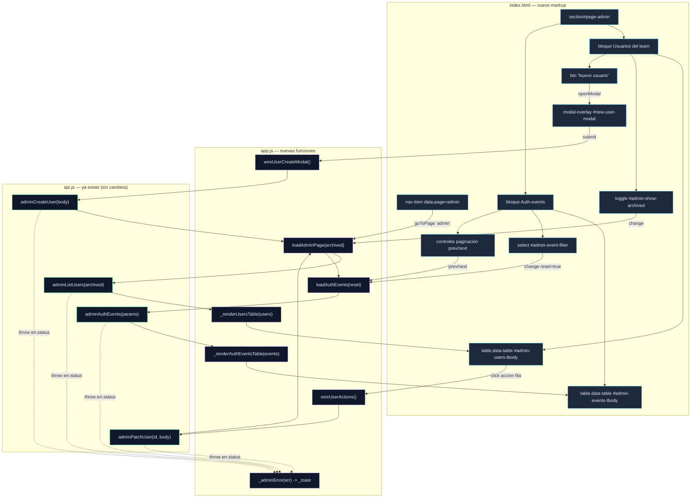
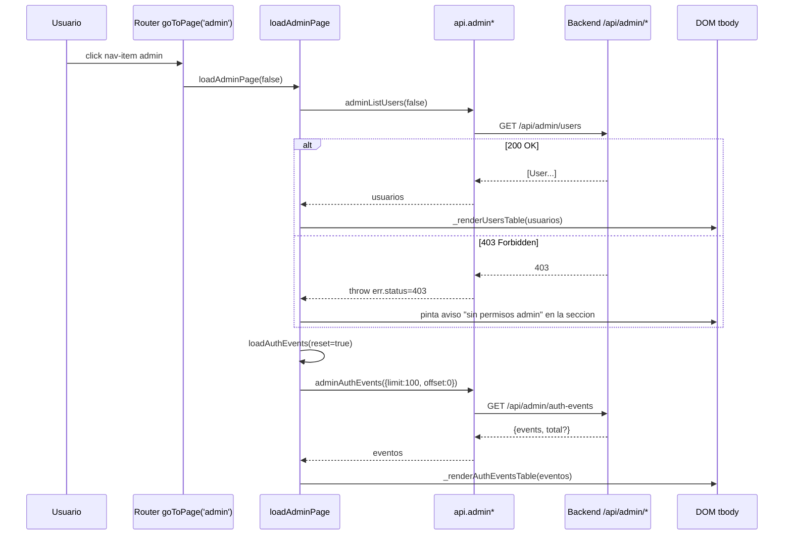
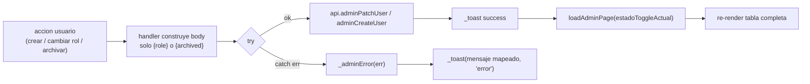
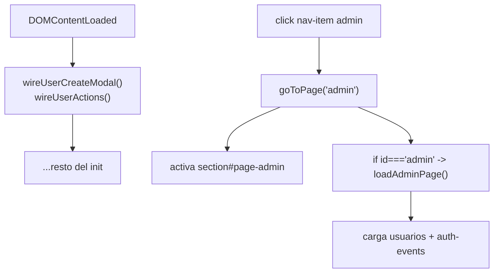

# Arquitectura — Feature "Admin UI"

> Autor: El Dibujante de Cajas (arquitecto, Alfred Dev)
> Proyecto: OffSec Journal · Frontend-only (backend completo)
> Fecha: 2026-06-15
> Estado: Propuesto — pendiente de validación de seguridad + aprobación del usuario

---

## 0. Hallazgos de la inspección del codebase (leer antes de implementar)

He inspeccionado `web/index.html`, `web/app.js` y `web/api.js`. El PRD asume
algunas cosas que **no coinciden con el código real**. Si no está en el
diagrama, no existe — así que corrijo el mapa antes de dibujar cajas:

| Lo que dice el PRD | Lo que hay realmente | Consecuencia |
|---|---|---|
| Existe `<section id="page-admin">` vacía | **No existe** ninguna sección admin. La última sección es `#page-search` (index.html:486) | Hay que **crear** la `<section>` entera, no rellenarla |
| Router con `case 'admin':` en un switch | **No hay switch.** El router es `goToPage(id)` (app.js:19) con bloque `if (id === '...')` | El punto de entrada es un `if`, no un `case` (ver §6) |
| Wrappers de api.js en líneas 101-108 | Correcto, confirmado (api.js:101-108) | Sin cambios en api.js |
| Existe el HTML del modal de creación | **No existe.** Todos los modales son explícitos en index.html (p. ej. new-person-modal:688) | Hay que **crear** el modal admin completo |
| `openModal`/`closeModal` usan clase | Confirmado: alternan clase `open` sobre `.modal-overlay` (app.js:199-200) | Reutilizar tal cual |
| Toggle archivados recarga desde API | El patrón `renderPeopleTable` filtra en cliente; aquí el PRD pide recargar. Respetamos el PRD | El toggle dispara `loadAdminPage(archived)`, no un filtro local |
| No hay `nav-item` para admin | Confirmado: nav-items van de overview a search (index.html:20-29) | Hay que **añadir** un nav-item `data-page="admin"` |

> Nota de acoplamiento: el código actual mezcla "modo demo" (lee `DATA.*`) con
> "modo online" (`state.online`). La Admin UI **solo tiene sentido online** (no
> hay seed de usuarios/auth-events en `data.js`). Decisión: Admin no usa caché
> `DATA.*`; va siempre directo a la API. Ver ADR-001.

---

## 1. Estructura de componentes

### 1.1 Vista de alto nivel



**Leyenda:** flechas continuas = flujo de control/datos en runtime; flechas
discontinuas = propagación de errores. Cajas azules = DOM nuevo; moradas =
lógica nueva en app.js; verdes = capa API existente (intacta).

### 1.2 Responsabilidades (una por caja)

- **`loadAdminPage(archived)`** — orquesta la carga de la página: pide usuarios
  y dispara auth-events. NO renderiza directamente (delega).
- **`_renderUsersTable(users)`** — vuelca usuarios en el `<tbody>`. Pura: data
  in, DOM out. NO hace fetch.
- **`wireUserCreateModal()`** — engancha el submit del modal (una sola vez al
  init). NO se vuelve a llamar en cada render.
- **`wireUserActions()`** — delegación de eventos sobre el `<tbody>` para las
  acciones por fila. Se engancha una vez; sobrevive a los re-render porque el
  listener vive en el `<tbody>` contenedor, no en cada `<tr>`.
- **`loadAuthEvents(reset)`** — gestiona paginación + filtro y pide a la API.
- **`_renderAuthEventsTable(events)`** — vuelca eventos. Pura.

> Separación de responsabilidades. No es negociable: `load*` hace I/O,
> `_render*` toca el DOM, `wire*` engancha listeners una vez. Si una función
> hace dos de las tres, son dos funciones.

---

## 2. Flujo de datos

### 2.1 Lectura (API -> DOM)



### 2.2 Mutación (DOM -> API -> recarga)



**Principio:** tras cualquier mutación con éxito se **recarga desde la API**
(no se parchea el DOM en sitio). Es más simple, evita estados divergentes y
respeta que el toggle de archivados recargue desde servidor. Coste: una llamada
extra por mutación. Aceptable para una pantalla de admin de bajo tráfico.

### 2.3 Estado en cliente

El estado de paginación/filtro NO va a `DATA.*` (eso es caché de negocio). Va a
una sub-rama de `state` ya existente en app.js:9:

```js
state.admin = {
  showArchived: false,   // toggle usuarios
  eventFilter: '',       // '' = todos
  eventOffset: 0,        // paginacion
  eventLimit: 100,       // fijo por PRD
};
```

> Razón: `state` ya es el contenedor de UI-state (currentPage, drawerPerson…).
> `DATA.*` es para entidades cacheadas que múltiples vistas comparten. Admin no
> comparte nada. Acoplamiento temporal evitado: nadie más lee `state.admin`.

---

## 3. Contrato de funciones JS (lo que implementa el senior-dev)

Todas en `web/app.js`. Firmas estables — los renders son puros, los loaders
hacen I/O, los wires se llaman una vez en el `DOMContentLoaded`.

```js
/**
 * Punto de entrada de la pagina admin. Llamado por goToPage('admin').
 * Carga usuarios (respetando el toggle de archivados) y dispara auth-events.
 * Maneja 403 pintando un aviso limpio en la propia seccion.
 * @param {boolean} [archived=state.admin.showArchived]
 * @returns {Promise<void>}
 */
async function loadAdminPage(archived) {}

/**
 * Render puro de la tabla de usuarios. No hace fetch.
 * Cada fila lleva data-user-id y los botones de accion con data-action.
 * @param {Array<{id,username,display_name,email,role,archived}>} users
 */
function _renderUsersTable(users) {}

/**
 * Engancha el submit del modal de creacion. Llamar UNA vez al init.
 * Construye body {username, role, display_name, email} y llama adminCreateUser.
 * En exito: closeModal + _toast + loadAdminPage(); en error: _adminError.
 */
function wireUserCreateModal() {}

/**
 * Delegacion de eventos sobre #admin-users-tbody. Llamar UNA vez al init.
 * Resuelve la accion por data-action: 'role' (cambiar rol) | 'archive' |
 * 'unarchive'. Construye body parcial ({role} o {archived}) y llama
 * adminPatchUser. En exito recarga via loadAdminPage().
 */
function wireUserActions() {}

/**
 * Carga (o recarga) la tabla de auth-events.
 * @param {boolean} [reset=false] si true pone offset=0 (al cambiar filtro).
 * Lee state.admin.{eventFilter,eventOffset,eventLimit} para componer params.
 * @returns {Promise<void>}
 */
async function loadAuthEvents(reset) {}

/**
 * Render puro de la tabla de auth-events + actualiza estado de los botones
 * prev/next (deshabilita prev si offset===0, next si vienen < limit filas).
 * @param {Array<{ts,event,username,ip,...}>} events
 */
function _renderAuthEventsTable(events) {}

/**
 * Helper privado: mapea un error de la capa api a un toast legible.
 * Centraliza el mapa HTTP->mensaje del apartado 5. No relanza.
 * @param {Error & {status?:number, detail?:string, body?:string}} err
 * @param {string} [fallback] mensaje por defecto si no hay status mapeado
 */
function _adminError(err, fallback) {}
```

> Las firmas son el contrato. Una vez aprobadas, el senior-dev implementa contra
> ellas sin renegociar. Si necesita una función auxiliar interna (p. ej.
> `_adminRoleSelectHtml()`), es libre — pero estas 7 son la interfaz pública.

---

## 4. Estructura del modal de creación

Markup nuevo en `index.html`, junto a los demás modales (tras new-client-modal,
~línea 775). Reutiliza `modal-overlay`, `modal sm`, `form-grid`, `form-input`,
`form-select`, `form-label`, `modal-actions`, `btn`, `btn primary` — exactamente
el patrón de `new-person-modal` (index.html:688).

```html
<!-- ===================== NEW USER MODAL ===================== -->
<div class="modal-overlay" id="new-user-modal">
  <div class="modal sm" onclick="event.stopPropagation()">
    <button class="modal-close" onclick="closeModal('new-user-modal')">✕</button>
    <div class="modal-title">Nuevo usuario</div>
    <div class="modal-sub">Se creará en el team del actor. El rol puede cambiarse después.</div>

    <div class="form-grid">
      <div>
        <div class="form-label">Username *</div>
        <input class="form-input mono" id="nu-username" placeholder="jdoe">
      </div>
      <div>
        <div class="form-label">Rol *</div>
        <select class="form-select" id="nu-role">
          <option value="member">member</option>
          <option value="admin">admin</option>
        </select>
      </div>
      <div>
        <div class="form-label">Display name</div>
        <input class="form-input" id="nu-display" placeholder="Jane Doe">
      </div>
      <div>
        <div class="form-label">Email</div>
        <input class="form-input mono" id="nu-email" type="email" placeholder="jane@org.tld">
      </div>
    </div>

    <div class="modal-actions">
      <button class="btn" onclick="closeModal('new-user-modal')">Cancelar</button>
      <button class="btn primary" id="nu-submit">Crear usuario</button>
    </div>
  </div>
</div>
```

Notas de contrato:
- IDs `nu-*` (new user), análogo a `npe-*` / `nc-*` ya existentes.
- `username` y `role` son obligatorios; valida en cliente con `_toast(...,'warn')`
  antes de llamar a la API (patrón de wireNewPersonModal, app.js:1762).
- **NO** hay selector de team (lo pone el backend) ni edición posterior de
  display_name/email (`adminPatchUser` solo acepta `role`/`archived`).
- Los valores de `<option>` para rol (`member`/`admin`) deben confirmarse contra
  el enum real del backend. Pendiente de verificación — ver §8.

---

## 5. Manejo de errores — mapa HTTP -> toast

Centralizado en `_adminError(err, fallback)`. Nunca se muestra el cuerpo crudo
de la respuesta al usuario. `kind` se corresponde con `_toast` (app.js:1419).

| Código | Situación | Mensaje de toast | kind |
|---|---|---|---|
| 400 | Body inválido (falta campo, formato) | "Datos inválidos: revisa los campos." (+ `err.detail` si es legible) | error |
| 403 | Actor no es admin del team | (en carga) aviso en sección, no toast; (en mutación) "No tienes permisos de administrador." | error |
| 409 | Username ya existe / conflicto de estado | "Ese usuario ya existe o el cambio entra en conflicto." | error |
| 401 | Sesión Authelia expirada | **No tocar** — la capa api ya dispara `onUnauthenticated` (api.js:38) -> reload | — |
| 404 | Usuario inexistente al hacer PATCH | "El usuario ya no existe. Recargando lista." + `loadAdminPage()` | warn |
| 5xx / red | Error de servidor o fetch caído | "Error del servidor. Inténtalo de nuevo." | error |
| otro | No mapeado | `fallback` o `err.detail || err.message` | error |

Patrón de implementación (pseudocódigo del helper):

```js
function _adminError(err, fallback = 'No se pudo completar la operación.') {
  const map = {
    400: 'Datos inválidos: revisa los campos.',
    403: 'No tienes permisos de administrador.',
    404: 'El elemento ya no existe.',
    409: 'Ya existe o hay un conflicto con el estado actual.',
  };
  const msg = map[err?.status] || err?.detail || fallback;
  _toast(msg, 'warn'.includes(String(err?.status)) ? 'warn' : 'error');
}
```

> El 403 en **carga** es especial: en vez de un toast efímero, pinta un bloque
> persistente dentro de `#page-admin` ("Esta sección requiere rol admin en tu
> team"). Un admin de otro team que abre #admin debe ver el porqué, no un toast
> que desaparece. Esto NO usa el overlay global `onForbidden` (api.js:42, que es
> para el 403 de identidad de toda la app) — se maneja localmente en
> `loadAdminPage` con un try/catch propio para no expulsar al usuario de la app.

---

## 6. Punto de entrada — integración con el router

El router real es `goToPage(id)` (app.js:19). No hay switch; hay un bloque de
`if (id === '...')` que refresca páginas al entrar. **Misma forma, una línea más:**

```js
// app.js, dentro de goToPage(id), junto a los otros if (línea ~27-34):
if (id === 'admin') loadAdminPage();
```

Y el nav-item nuevo en `index.html` (tras el de search, línea 29):

```html
<div class="nav-item" data-page="admin"><span class="nav-icon">⚙</span><span class="nav-label">Admin</span></div>
```

El click ya está cableado genéricamente (app.js:159:
`item.addEventListener('click', () => goToPage(item.dataset.page))`), así que el
nuevo nav-item funciona sin tocar el wiring de navegación.

**Init (`DOMContentLoaded`, app.js:1656):** registrar los wires UNA vez, junto a
los demás `wire*`:

```js
wireUserCreateModal();
wireUserActions();
```

No se llama a `loadAdminPage()` en el init: la página admin se carga
perezosamente la primera vez que el usuario navega a ella (lazy, como `map` con
`initMap`). Evita un fetch admin innecesario para usuarios que nunca abren la
sección — y evita ruido de 403 en la consola para no-admins.



---

## 7. Orden de implementación recomendado

Construir de dentro hacia fuera, validando cada capa contra la API antes de
añadir interactividad. Cada paso es verificable de forma aislada.

1. **Markup estático** (index.html): `nav-item` + `section#page-admin` con los
   dos bloques, las dos `table.data-table` con `<thead>` y `<tbody>` vacíos
   (ids `admin-users-tbody`, `admin-events-tbody`), el toggle, el select de
   filtro, los botones prev/next y el `#new-user-modal`.
   *Verificable:* navegar a #admin muestra la estructura vacía sin errores JS.

2. **Lectura de usuarios:** `loadAdminPage()` + `_renderUsersTable()` + el
   `if (id==='admin')` en el router. Sin acciones aún.
   *Verificable:* la tabla se llena con datos reales del backend.

3. **Toggle archivados:** cablear `#admin-show-archived` -> `state.admin
   .showArchived` -> `loadAdminPage(true/false)`.
   *Verificable:* el toggle recarga y muestra/oculta archivados desde la API.

4. **Auth-events:** `loadAuthEvents()` + `_renderAuthEventsTable()` + filtro
   (reset offset=0) + paginación prev/next.
   *Verificable:* la tabla pagina y filtra contra el backend.

5. **Creación de usuario:** `wireUserCreateModal()` + validación cliente +
   recarga en éxito.
   *Verificable:* crear un usuario lo hace aparecer en la tabla.

6. **Acciones por fila:** `wireUserActions()` (delegación) — cambiar rol,
   archivar/desarchivar con `adminPatchUser`.
   *Verificable:* cambiar rol y archivar refrescan la fila.

7. **Errores:** `_adminError()` + el bloque de 403-en-carga en la sección.
   *Verificable:* un actor no-admin ve el aviso limpio; los 400/409 salen como
   toasts legibles.

> Razón del orden: lectura antes que escritura (menos riesgo, feedback inmediato
> de que el contrato API casa), y el manejo de errores al final como capa
> transversal una vez existen todos los puntos de fallo a cubrir.

---

## 8. Decisiones de arquitectura (ADRs resumidos)

> Los ADRs completos se redactarán en `docs/adr/` si el usuario lo pide. Resumen
> de las decisiones registradas en memoria:

- **ADR-001 — Admin no usa caché `DATA.*`, va directo a la API.**
  No hay seed de usuarios/auth-events; la sección solo funciona online. Evita
  inventar una caché que nadie más consume.
- **ADR-002 — Recarga tras mutación en vez de patch optimista del DOM.**
  Simplicidad y consistencia sobre micro-rendimiento; pantalla de bajo tráfico.
- **ADR-003 — Delegación de eventos en el `<tbody>` para acciones de fila.**
  Un listener sobreviviente a re-render, en lugar de re-cablear cada `<tr>`.
- **ADR-004 — 403 en carga se maneja local, no con el overlay global.**
  El overlay `onForbidden` es para el 403 de identidad de toda la app; un admin
  de otro team no debe ser expulsado, solo informado dentro de la sección.

## 9. Pendiente de verificar (bloqueante menor para el senior-dev)

1. **Enum de roles del backend:** confirmar que los valores son `member` /
   `admin` (el código pinta "miembro"/"admin" en UI, app.js:1328, pero eso es
   etiqueta, no valor). Mirar el modelo Pydantic de usuario en el backend.
2. **Forma de la respuesta de `adminAuthEvents`:** ¿devuelve `[...]` plano o
   `{events:[...], total:N}`? Determina si la paginación puede mostrar total o
   solo prev/next. El diseño asume lo segundo (más conservador).
3. **Campos reales de un auth-event** (ts, event, username, ip, success…) para
   las columnas de `_renderAuthEventsTable`.

> Estos tres no bloquean el markup ni la lectura de usuarios (pasos 1-3). Se
> resuelven con una ojeada al backend antes del paso 4.

---

## 10. Gate de arquitectura

**VEREDICTO: APROBADO CON CONDICIONES**

**Resumen:** Diseño completo y alineado con los patrones reales del codebase
(modales, toasts, tablas, router `goToPage`). Reutiliza CSS y capa API
existentes sin nuevas dependencias.

**Hallazgos bloqueantes:** ninguno.

**Condiciones pendientes:**
1. Validación del security-officer (control de acceso 403, no exposición de
   datos sensibles en auth-events, escape de HTML en todos los `_render*`).
2. Verificar los 3 puntos del §9 contra el backend antes del paso 4.

**Próxima acción recomendada:** revisión de seguridad en paralelo + aprobación
del usuario. Con eso, el senior-dev arranca por el paso 1 del §7.
